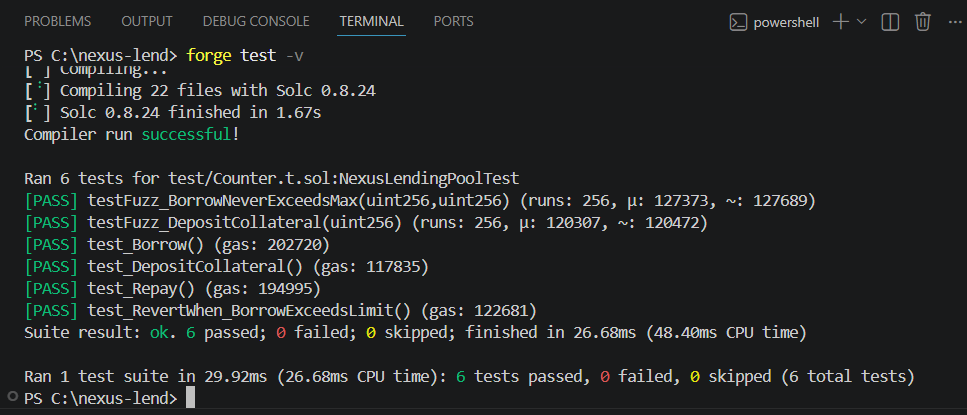

# Nexus Lend

A non-custodial collateralized lending protocol deployed on Ethereum Sepolia. Users deposit ETH as collateral to borrow ERC20 tokens, with on-chain liquidation logic and a React/TypeScript frontend.




## Architecture

The protocol is built around a single `NexusLendingPool` contract implementing a 150% collateralization ratio with automatic liquidation at 120%. Interest accrual is tracked per-position using block timestamps.

**Smart Contract:** Solidity 0.8.24 · Foundry · OpenZeppelin  
**Frontend:** React · TypeScript · wagmi · viem · Vite  
**Network:** Ethereum Sepolia Testnet

## Core Mechanics

- ETH collateral deposit with per-address position tracking
- ERC20 borrow against collateral with `COLLATERAL_RATIO` enforcement
- Liquidation path for undercollateralized positions — callable by any address
- `SafeERC20` transfers, `ReentrancyGuard` on all state-changing functions
- Custom error types for gas-efficient reverts

## Deployment

| Contract | Network | Address |
|---|---|---|
| NexusLendingPool | Sepolia | [0x1e96DE8C083FE1C74d2e50a50fB696941F5d9b20](https://sepolia.etherscan.io/address/0x1e96de8c083fe1c74d2e50a50fb696941f5d9b20) |

Source verified on Etherscan — Exact Match.

## Test Suite

6 tests · 0 failures · includes fuzz testing with 256 runs per invariant

```bash
forge test -v
```

| Test | Type | Status |
|---|---|---|
| test_DepositCollateral | Unit | PASS |
| test_Borrow | Unit | PASS |
| test_Repay | Unit | PASS |
| test_RevertWhen_BorrowExceedsLimit | Unit | PASS |
| testFuzz_DepositCollateral | Fuzz (256 runs) | PASS |
| testFuzz_BorrowNeverExceedsMax | Fuzz (256 runs) | PASS |

## Local Setup

```bash
git clone https://github.com/BlockchainInes/nexus-lend
cd nexus-lend
forge install
forge build
forge test
```

Deploy:

```bash
cp .env.example .env
# Add PRIVATE_KEY, SEPOLIA_RPC_URL, ETHERSCAN_API_KEY, BORROW_TOKEN
forge script script/Counter.s.sol:DeployNexusLendingPool \
  --rpc-url $SEPOLIA_RPC_URL \
  --broadcast \
  --verify
```

## Frontend

Live demo: [nexus-lend-ui.vercel.app](#) *(coming soon)*

```bash
cd nexus-lend-ui
npm install
npm run dev
```

## Security Considerations

- Reentrancy protection on all external calls
- Pull-over-push pattern for ETH transfers
- Collateral locked until debt is fully repaid
- No price oracle in current version — production deployment would integrate Chainlink Data Feeds

## License

MIT
